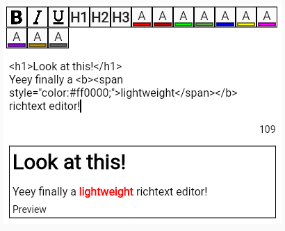

# Flutter HTML Editor

Flutter HTML Editor is a simple HTML-based Richtext editor, which is able to edit and parse a selected set of HTML tags into a Flutter widget. 

## Features

- Code Editor where HTML text can be written with an optional preview output
- Richtext-Renderer which takes in HTML produced by the editor and converts it into a widget
- Customization options for Editor and Renderer

## Usage

1. Import the package ```import 'package:html_editor/editor.dart';``` for the editor or ```import 'package:html_editor/renderer.dart';``` for the renderer
2. Create an environment with a **finite width**, as the widgets will take up all available horizontal space
3. Instantiate ```RichTextEditor``` or ```RichTextRenderer```
4. Set desired parameters like the ```onChanged``` callbacks for retrieving the richtext 

## Example
    SizedBox(
        width: 400,
        child: RichTextEditor(
            onChanged: (String html) {
                // called every time the code in the input text is changed
                // do something with the richtext
            },
        ),
    ),

